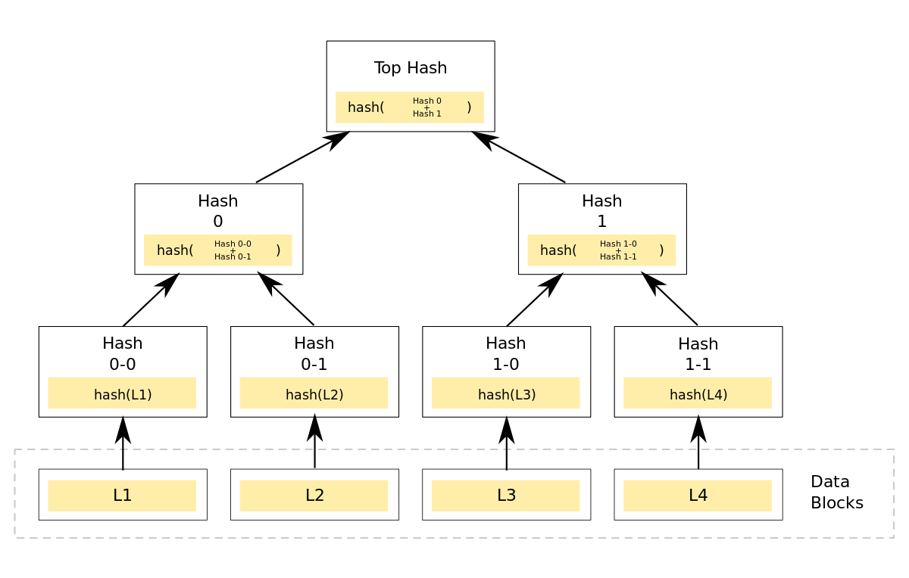
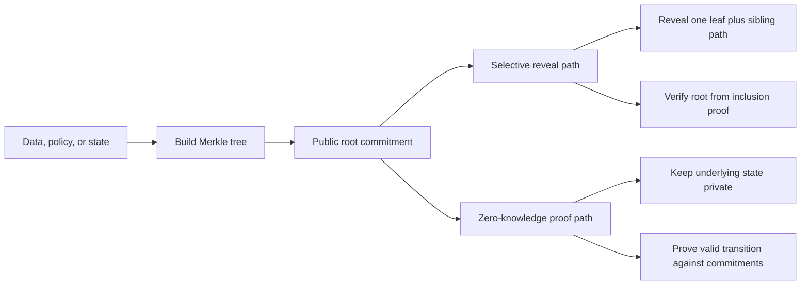
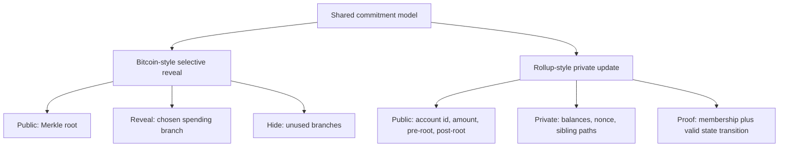

# zkp-merkle-tree

Go proof of concept for Merkle trees, inclusion proofs, and a zero-knowledge flow that proves both a balance transition and Merkle membership against public state roots.



The main idea is simple: commit to a larger set of data with one Merkle root, then reveal only the branch you need or prove statements about the committed state without exposing the whole state.





## Why this pattern matters

- One root can commit to a full state or policy set.
- A standard Merkle proof reveals one leaf and a short sibling path, not the whole set.
- In ZK systems, the same commitment model is used for private state transitions.
- Hash choice and tree rules affect proving cost, not just verification.

It includes:

- Binary Merkle trees with SHA-256 and Poseidon
- Inclusion proof generation and verification
- A Bitcoin-style selective reveal example
- A rollup-style ZK example with private Merkle paths
- A light-client SPV example for transaction inclusion
- A bridge-exit example for selective withdrawal proofs

## Repository structure

- `internal/hash`: hash abstraction plus SHA-256 and Poseidon backends.
- `internal/merkle`: deterministic binary Merkle trees and inclusion proofs.
- `internal/zk`: zero-knowledge proving helpers and circuits.
- `cmd/zkp-merkle-demo`: CLI for building trees, generating proofs, and running demos.
- `examples/bitcoin-p2mr`: selective branch reveal demo.
- `examples/zk-rollup`: state commitment demo.
- `examples/light-client-spv`: block transaction inclusion demo.
- `examples/bridge-exit`: bridge withdrawal inclusion demo.

This is a proof of concept, not production infrastructure.

## Design notes

- Merkle code and ZK proving code are separate packages.
- Leaves and internal nodes use different hash prefixes.
- Odd leaf counts duplicate the last node on each level.
- `sha256` is the standard Merkle backend.
- `poseidon` is available for circuit-friendly Merkle trees.
- `poseidon2` is used in the proving layer for account commitments and internal Merkle nodes.
- The proving package caches compiled circuits and Groth16 key material by Merkle depth within a running process.

## Current ZK scope

- Public inputs: account id, transfer amount, pre-state root, post-state root.
- Private inputs: old balance, new balance, nonce, sibling paths, path direction bits.
- The circuit proves the balance transition is valid and that the old and new account leaves are included in the corresponding public roots.

## Quick start

```sh
make tidy
make test
make demo-bitcoin
make demo-rollup
make demo-light-client
make demo-bridge-exit
```

## CLI examples

```sh
go run ./cmd/zkp-merkle-demo root --hash sha256 --leaf alice --leaf bob --leaf carol
go run ./cmd/zkp-merkle-demo prove --hash poseidon --index 1 --leaf alice --leaf bob --leaf carol
go run ./cmd/zkp-merkle-demo verify --hash sha256 --proof-file ./testdata/sample-proof.json
go run ./cmd/zkp-merkle-demo zk-balance --account-id 7 --old-balance 25 --amount 10 --nonce 1
```

## Useful examples

- `examples/bitcoin-p2mr`: one root commits to several spending policies; spending reveals only the chosen branch.
- `examples/light-client-spv`: a light client verifies that one transaction is included in a block root without downloading the full block body.
- `examples/bridge-exit`: a user proves one withdrawal claim exists in a published exit root without exposing the entire exit set.
- `examples/zk-rollup`: a prover demonstrates a private balance update against public pre-state and post-state roots.

The cache in the ZK prover is process-local. A long-lived service or test process benefits from cache hits; a one-shot CLI invocation still does a fresh setup because it runs in a new process.

See [docs/ARCHITECTURE.md](docs/ARCHITECTURE.md) for the package boundaries and security model, and [docs/post.md](docs/post.md) for the original study narrative.

